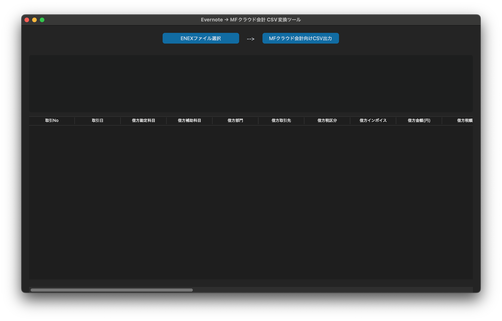

# evernote-mf-importer：EvernoteからMFクラウド会計への仕訳データ連携ツール

## ユースケースと目的

**Evernoteからエクスポートした領収書ノートを、MFクラウド会計に対応したCSV形式に変換することで、仕訳登録作業を効率化します。**

Evernoteに記録した領収書情報（写真付き）を活用することで、日常的な記録をそのまま会計処理に活かし、入力作業の手間を削減します。

## アクター（利用者）

- 自分（個人事業主／法人代表）

## 前提条件

- Evernote内の特定ノートブックに、領収書ノートを保存していること
- 各ノートの題名に、以下の形式で情報が記載されていること：

  ```
  取引日付_勘定科目_取引先名_取引金額（税込）_メモ
  ```

  例：`2025.01.01_接待交際費_スターバックス_1,100円_Aさん`

---

## 使用方法

### ✅ GUIから実行（推奨）

GUI画面で操作することで、ENEXファイルの選択からCSV出力までを簡単に行えます。

1. ターミナルでルートディレクトリに移動
2. 以下のコマンドを実行：

   ```bash
   python3 -m src.gui_ctk
   ```

3. GUI画面が起動し、「ENEXファイル選択」→「CSV出力」の順にボタンを押すだけでCSVが生成されます。



---

### 🛠 ターミナルからの実行（CLI）

1. Evernoteから「題名のみ」をエクスポート対象として、ENEXファイルを作成
2. 以下のコマンドを実行：

   ```bash
   python3 main.py
   ```

3. ファイル選択ダイアログが表示され、対象ファイルを選ぶとCSVが自動生成されます。

---

## 出力されるCSVの仕様（MFクラウド会計）

出力されるCSVは以下の列構成です（MFクラウドの仕訳帳インポート形式に準拠）：

| 項目名（ヘッダー）       | 項目例         |
|--------------------------|----------------|
| 取引No                   | 1              |
| 取引日                   | 2025/01/01     |
| 借方勘定科目             | 接待交際費     |
| 借方補助科目             | （空欄）       |
| 借方部門                 | （空欄）       |
| 借方取引先               | （空欄）       |
| 借方税区分               | （空欄）       |
| 借方インボイス           | （空欄）       |
| 借方金額（円）           | 1100           |
| 借方税額                 | （空欄）       |
| 貸方勘定科目             | 未払金         |
| 貸方補助科目             | （空欄）       |
| 貸方部門                 | （空欄）       |
| 貸方取引先               | （空欄）       |
| 貸方税区分               | （空欄）       |
| 貸方インボイス           | （空欄）       |
| 貸方金額（円）           | 1100           |
| 貸方税額                 | （空欄）       |
| 摘要                     | スターバックス |
| 仕訳メモ                 | Aさん          |
| タグ                     | （空欄）       |
| MF仕訳タイプ             | （空欄）       |
| 決算整理仕訳             | （空欄）       |
| 作成日時                 | （空欄）       |
| 作成者                   | （空欄）       |
| 最終更新日時             | （空欄）       |
| 最終更新者               | （空欄）       |

※ 貸方勘定科目はすべて「未払金」で固定出力されます（必要に応じてMFクラウド上で編集してください）。

---

## セットアップ手順（初回のみ）

### 1. 仮想環境の作成

```bash
cd evernote-mf-importer
python3 -m venv .venv
```

### 2. 仮想環境の有効化

- **Mac / Linux：**
    ```bash
    source .venv/bin/activate
    ```
- **Windows（PowerShell）：**
    ```powershell
    .venv\Scripts\Activate.ps1
    ```

### 3. 依存パッケージのインストール

```bash
pip install -r requirements.txt
```

---

## 使用パッケージ一覧

- `beautifulsoup4`：ENEXファイルの解析  
- `lxml`：XMLパース用（高速・安定）  
- `pytest`：単体テスト  
- `customtkinter`：GUI画面表示用（`src.gui_ctk`で使用）

---

## 期待される効果

- 手動での仕訳入力作業を削減
- Evernoteの記録をそのまま会計処理に活用
- 記録と仕訳の整合性を保ちやすくなる
- CLI / GUI の両方で利用でき、操作の自由度が高い

---

## ライセンス

MIT License
